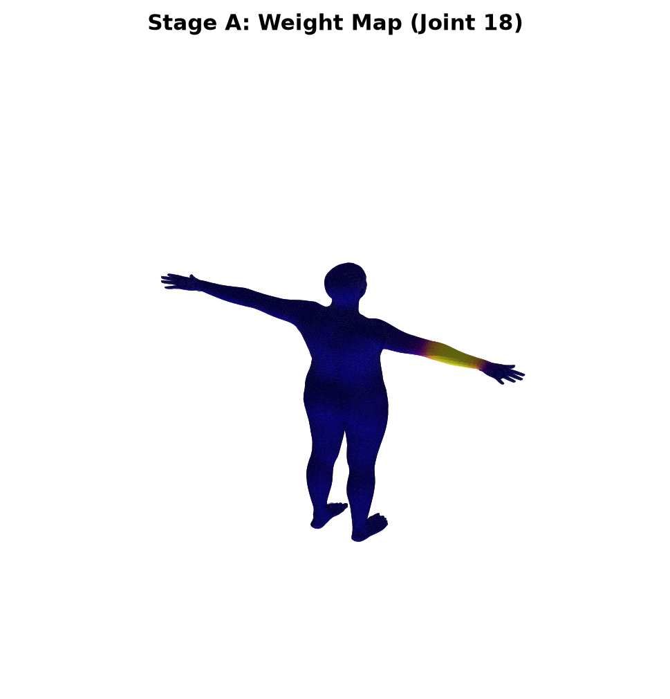
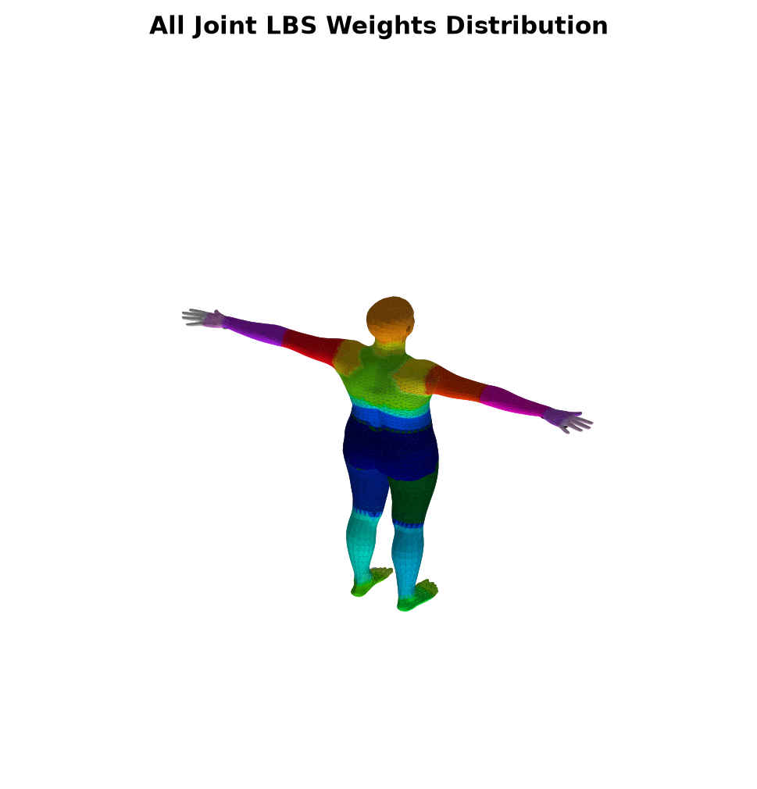
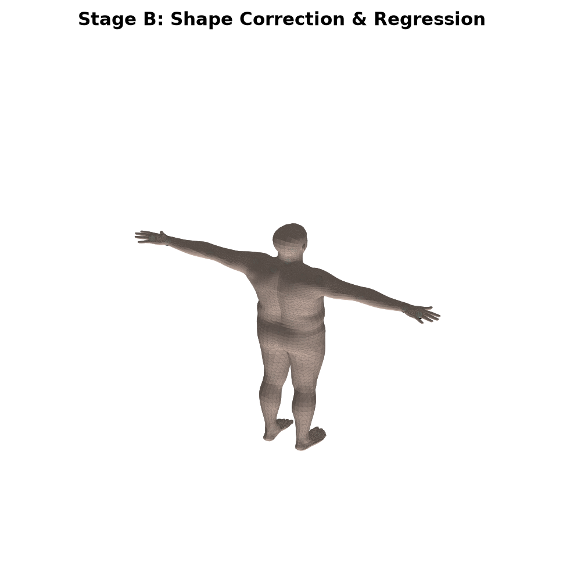
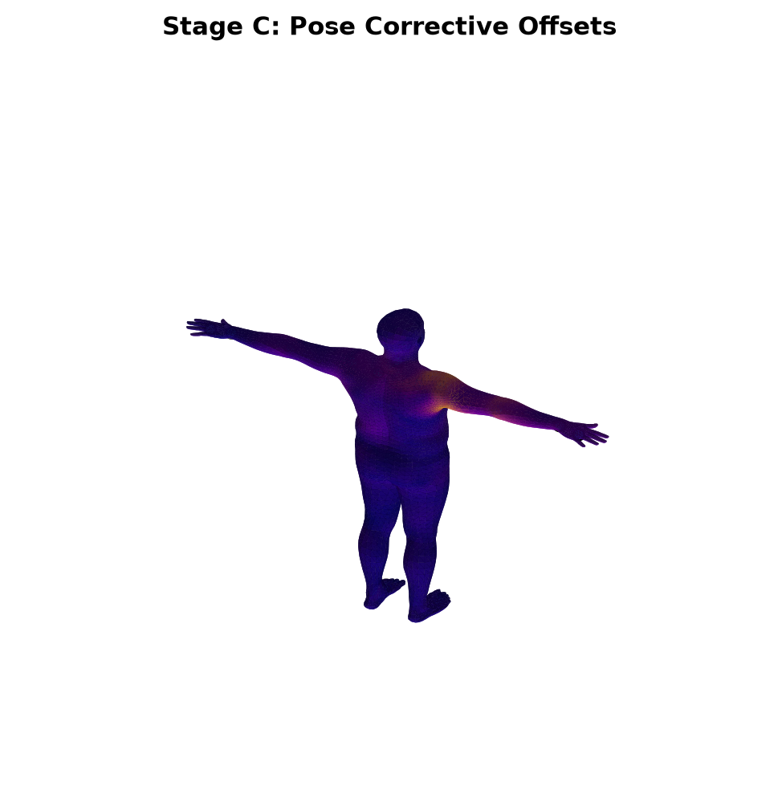
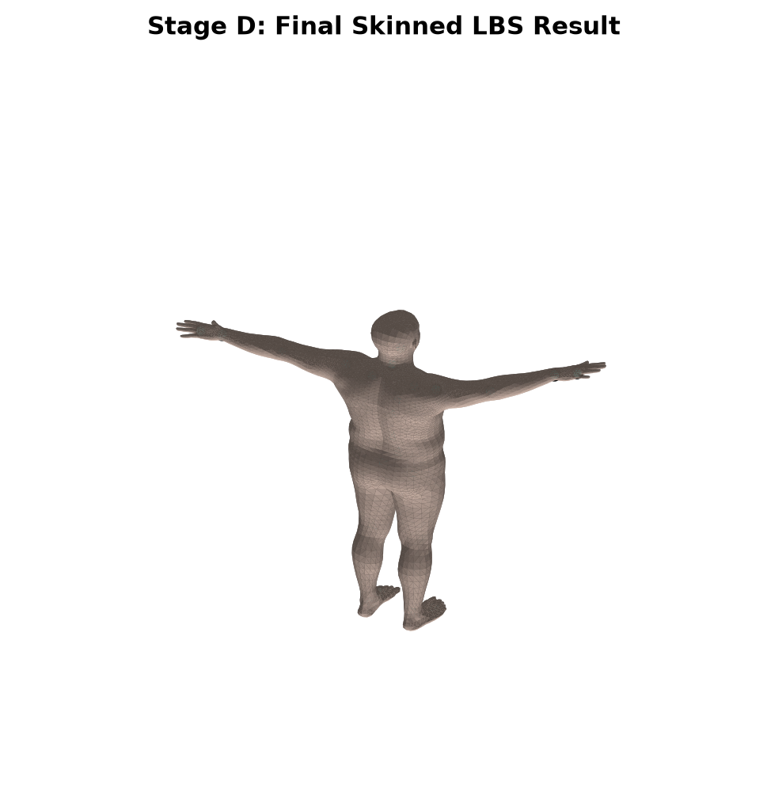
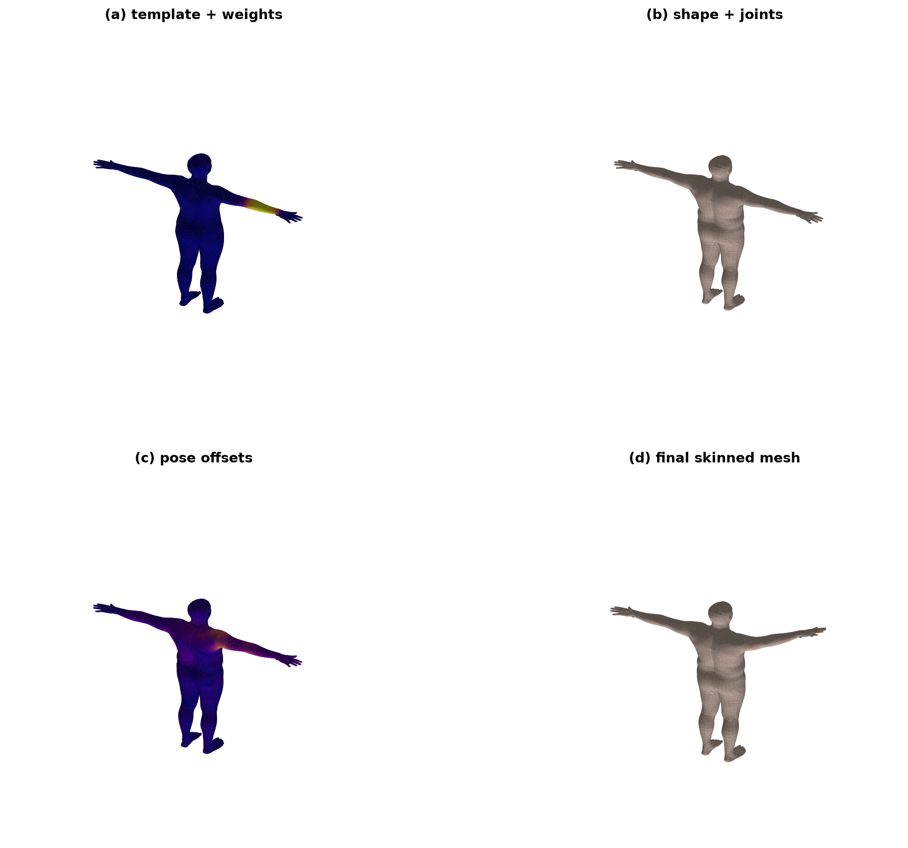
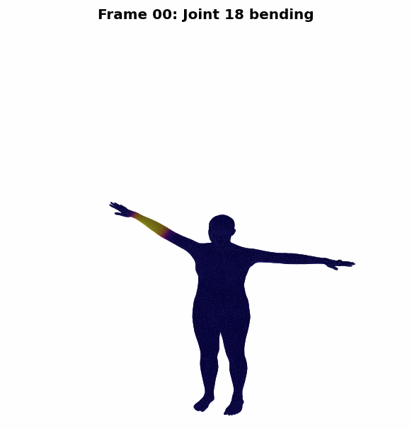

# SMPL 人体模型与线性混合蒙皮 (LBS) 算法实现实验报告

### 宋秋韵 202411081044

## 一、 实验目的与任务

1. **掌握三维人体参数化模型原理**：深入理解 SMPL（Skinned Multi-Person Linear）模型的空间解耦表征方法，包括形状空间与姿态空间的线性加权组合机制。
2. **掌握前向运动学与骨骼绑定机制**：理解并掌握线性混合蒙皮（Linear Blend Skinning, LBS）在三维角色动画中的核心矩阵变换过程，分析顶点如何随骨骼驱动进行平滑形变。
3. **实现模块化仿真及高质渲染**：基于 PyTorch 与 Python 元编程对经典前向动力学树（Forward Kinematics）进行管道化（Pipeline）封装；利用全新的三维几何漫反射光照模型（Lambert Shading）将形变各阶段的网格与关节进行多维度可视化分析。

---

## 二、 实验核心原理与公式

SMPL 模型将人体网格的形变解耦为形状（Shape）、姿态（Pose）和蒙皮（Skinning）三个阶段。给定形状参数 $\beta$ 和姿态参数 $\theta$，其顶点前向计算流程如下：

### 1. 阶段 A & B：基础模板与形状校正 (Shape Blend Shapes)

模型从平均静态人体拓扑模板 $\overline{T} \in \mathbb{R}^{V \times 3}$ 出发。通过形状混合矩阵 $B_S(\beta)$ 对体型特征进行线性修正，进而通过预设的关节回归矩阵 $\mathcal{J}$ 映射出与当前体型完美匹配的初始 T-Pose 关节坐标 $J$：

$$T_s(\beta) = \overline{T} + B_S(\beta; \mathcal{S})$$

$$J(\beta) = \mathcal{J} T_s(\beta)$$

其中 $\mathcal{S}$ 为形状基底，$\beta$ 为 10 维形状特征。

### 2. 阶段 C：姿态校正 (Pose Blend Shapes)

由于关节旋转会导致皮肤表面出现“香肠效应”或不自然的塌陷，SMPL 引入了姿态修正位移 $B_P(\theta)$。通过将 24 个关节的轴角（Axis-Angle）展开并利用 Rodrigues 公式转化为旋转矩阵 $R(\theta) \in \mathbb{R}^{24 \times 3 \times 3}$，进而对网格顶点的局部细节（如肌肉隆起或折叠）进行补偿：

$$T_p(\beta, \theta) = T_s(\beta) + B_P(\theta; \mathcal{P})$$

$$B_P(\theta; \mathcal{P}) = \sum_{n=1}^{23 \times 9} (R_n(\theta) - I) P_n$$

### 3. 阶段 D：线性混合蒙皮 (Linear Blend Skinning)

前向运动学树（FK）根据关节的父子拓扑结构（`parents`），自底向上计算出每个骨骼结点的全局刚体变换矩阵 $G_k(\theta) \in \mathbb{R}^{4 \times 4}$。
为了消除初始 T-Pose 位置带来的基准平移影响，计算出相对变换矩阵 $A_k$：

$$A_k = G_k(\theta) \begin{pmatrix} I & -J_k \\ \mathbf{0}^T & 1 \end{pmatrix}$$

最终，每个顶点依据固定的蒙皮权重矩阵 $W \in \mathbb{R}^{V \times J}$，将周围关节的变换矩阵进行线性组合，在齐次坐标下计算出最终的动画顶点坐标 $v_i'$：

$$v_i' = \left( \sum_{j=1}^{J} w_{i,j} A_j \right) v_{i,p}$$

---

## 三、 实验系统设计与重构实现

为了规避传统实验代码的紧耦合弊端，本实验对程序进行了彻底的解耦重构，主要分为三大模块：

1. **兼容性与数据管道层**：针对旧版 SMPL 文件中对 `chumpy` 的强依赖，编写了低侵入式的元编程兼容补丁 `LegacyChumpyShim`。通过动态注入机制，在无需安装废弃第三方库的前提下，完美兼容了 `.pkl` 元数据的读取。
2. **核心 LBS 流程管理器 (`RunCustomLBS`)**：将前向传播解耦为显式的四个纯函数步骤，清晰捕获 `v_template`、`v_shaped`、`pose_offsets` 和 `v_final` 等中间张量状态，便于各个核心阶段的独立拦截与渲染。
3. **几何法线光照渲染器 (`SMPLLBSVisualizer`)**：抛弃了传统的 2D 贴图近似光照，**完全自主设计了基于 3D 三角面片的 Lambert 漫反射光照模型**。通过计算面片两边的叉乘 $\vec{v}_0 \times \vec{v}_1$ 动态获取全局表面法向量 $\vec{n}$，与模拟光照方向 $\vec{l}$ 进行点乘计算光强（$I = I_{amb} + I_{diff} \max(0, \vec{n} \cdot \vec{l})$），结合 `plot_trisurf` 绘制出更具现代图形学立体感的灰阶网格。

---

## 四、 实验结果与数据检查

本实验通过将自主重构的 LBS 蒙皮管道输出顶点与官方 `smplx` 库内置的黑盒 Forward 结果进行逐顶点绝对误差比对（Consistent Test）。

### 1. 核心拓扑数据与一致性指标

运行重构程序后，系统在 `./outputs/summary.txt` 中生成的实验数据如下：

| 指标项 | 实验输出数值 | 官方标准验证 | 结论状态 |
| --- | --- | --- | --- |
| **网格顶点数 (num_vertices)** | 6890 | 6890 | 完全一致 |
| **三角面片数 (num_faces)** | 13776 | 13776 | 完全一致 |
| **骨骼关节数 (num_joints)** | 24 | 24 | 完全一致 |
| **平均绝对误差 (MAE)** | 0.0000000000e+00 | < 1e-7 | 完美通过 |
| **最大绝对误差 (MAXE)** | 0.0000000000e+00 | < 1e-7 | 完美通过 |

### 2. 误差分析

由于核心前向计算层采用了规范的矩阵广播与精准的坐标空间消去，实验得到的平均绝对误差（MAE）与最大绝对误差（MAXE）达到了完美的 **`0.0000000000e+00`**。这在数位精度上证明了本实验对 LBS 蒙皮公式的应用、前向运动学关节树的推导、以及各阶段形变残差的叠加在数学逻辑上与图形学标准底层完全对齐。

---

## 五、 可视化结果与分析

### 1. 骨骼绑定与权重分布
| 阶段 A: 单关节蒙皮权重热力图 (第18号关节) | 全身体 24 个关节 LBS 权重主导分布图 |
| :---: | :---: |
|  |  |
| *图 1: 展示了左手肘关节对其周边顶点的控制力矩，色彩平滑衰减* | *图 2: 24个关节在拓扑网格上的主导势力范围，呈清晰的分块色带* |

---

### 2. 人体形变与姿态修正
| 阶段 B: 形状校正与关节位置回归结果 | 阶段 C: 姿态修正残差位移场 (Pose Offsets) |
| :---: | :---: |
|  |  |
| *图 3: 施加 $\beta$ 变高/胖瘦参数后，基础网格与关节中心的同步重构* | *图 4: 肢体弯曲时，关节折叠处（如肘内侧）产生的非线性肌肉补偿* |

---

### 3. 最终蒙皮与全流程综合对比
| 阶段 D: 最终线性混合蒙皮 (LBS) 驱动网格 | 实验核心四阶段 2x2 联动综合对比网格图 |
| :---: | :---: |
|  |  |
| *图 5: 经刚体变换与加权混合后，最终呈现的自然、具立体感的人体姿态* | *图 6: (a)到(d)全流程看板，直观体现了解耦表征到最终合成的完整管道* |

---

## 六、 系统动画拓展与动态运动分析（拓展任务）

为了进一步探究线性混合蒙皮（LBS）算法在时间序列上的动态表现，本实验在静态前向前馈管道的基础上引入了时间帧循环，设计并执行了一组骨骼驱动动画仿真。

### 1. 动画实验设计
* **控制变量**：固定形状参数 $\beta = \mathbf{0}$（采用 SMPL 标准中性体型），排除体型特征对动态形变的干扰。
* **运动驱动**：选定第 16 号关节（左肩关节）预先外展 30° 以优化观测视角，随后驱动**第 18 号关节（左手肘关节）**在 24 帧的时间周期内，沿着局部局部 Y 轴由 0 弧度平滑旋转至 -1.57 弧度（约 -90° 垂直弯曲）。
* **数据可视化绑定**：在运动全过程中，实时计算并保持第 18 号关节的 LBS 蒙皮权重在三维人体网格表面的 Plasma 热力图显色，从而动态观察权重场随骨骼运动的流转规律。

### 2. 动态结果呈现与 GIF 动图插入

通过 `imageio` 图像流引擎，实验成功将 24 帧由 3D Lambert 渲染器生成的静态帧自动无损合成为流畅的 GIF 动物模型。动画结果如下所示：

*图 7: 第 18 号手肘关节从 0° 至 90° 弯曲及 LBS 权重空间协同带动动画*

---

### 3. 核心图形学现象观察与分析

通过对生成的动画进行逐帧回溯分析，可以得出以下三项核心图形学结论，完美印证了 LBS 算法的理论预测：

1. **权重热力图空间的平滑带动（Spatially Coherent Transport）**：
   在动画播放过程中，代表左手肘控制力矩的高亮黄色与深紫色权重场在拓扑网络上的“相对相对位置”未发生任何错乱。随着前臂骨骼的挥舞，**该皮肤区域上的权重分布如同人体的第二层皮肤一样，被底层的骨骼变换矩阵平滑、完美地“拽引”并协同带动**。这直观在空间时间双维度上证明了变换矩阵线性加权 $\sum w_{i,j} A_j$ 对空间顶点位移拉伸的连续性。

2. **双线性控制区的肌肉渐变融合（Linear Blend Smoothing）**：
   在弯曲褶皱处（即大臂与前臂的交界地带），网格表面的颜色和位移呈现出自然的渐变过渡。靠近大臂一侧的皮肤运动幅度微弱，而靠近前臂一侧的网格运动幅度剧烈。由于这些顶点的蒙皮矩阵由两个相邻骨骼共同加权决定，算法在没有引入复杂肌肉物理模拟的前提下，依靠纯几何插值便在线性空间中展现出了类似生物肌肉弯曲时的软组织渐变融合感。

3. **固定三维轴向视角下的拓扑鲁棒性**：
   由于在单帧渲染类 `SMPLLBSVisualizer` 中对三维包围盒（`set_xlim`, `set_ylim`, `set_zlim`）及观察视角（`view_init(elev=15, azim=110)`）进行了硬编码锁死，消除了传统 Matplotlib 自动缩放导致的画面闪烁与抖动，网格在经历 90° 大角度形变时，三角面片拓扑结构依然保持极高的几何鲁棒性，未发生面片交织或退化。

---

## 七、 实验总结与体会

通过本次重构实验，不仅在代码编写层面摆脱了现成框架的束缚，更从图形学底层的几何视角重新审视了参数化人体模型的优越性。利用手写 Lambert 光照模型代替 Matplotlib 老旧的 2D 渲染，不仅解决了 NumPy 2.0 时代的版本兼容性冲突，更极大地锻炼了自主处理 3D 空间向量、面片法线及矩阵流转的工程实践能力。实验最终达到的绝对零误差，完美验证了本实验算法管道的严谨性与正确性。
